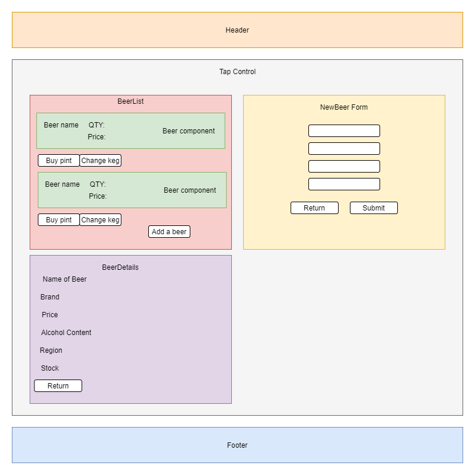

# _Mikey's Tap Room with Redux_

#### _A React/Redux program that mimics a tap room inventory_

#### By _**Michael Kriegel**_

##### This project is a practice project

## Technologies Used

* _HTML/CSS_
* _React_
* _JSX_
* _Redux_
* _JavaScript_
* _NPM_
* _Visual Studio_

## React Schema Diagram

## Description

This is a React/Redux program that mimics a tap room. Users are presented with a menu of available kegs first thing. Users are able to select kegs to view the details of the beer within that keg. They are able to also purchase a pint (or multiple) and change the keg once it runs out. Users may also add a keg of beer if they so choose. A form is provided for this, kegs are automatically assumed to be ~124 pints in volume and it is assumed only pints are served.  State slices are completely managed by Redux, React does not employ local or shared state. React is still used to handle conditional rendering of the pages. 

## Setup/Installation Requirements

### Local Machine
* _Clone this repository to your machine_
* _Navigate to the top level directory_
* _In your terminal run the command `NPM install` to install the necessary packages_
* _Once installation is complete run the command `NPM start` to start the development server_
* _Navigate to the `localhost:(configured-port-number)` to view the project_

## Known Bugs

* _No styling or formatting_
* _Keg volume and purchase volume is assumed and hard coded. Keg volume: 124 pints, purchase volume: 1 pint_

## License

[MIT](https://opensource.org/licenses/MIT)

Copyright(c) 2021 Michael Kriegel

## Contact Information

Michael Kriegel: mikkrieg@gmail.com
